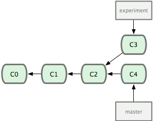
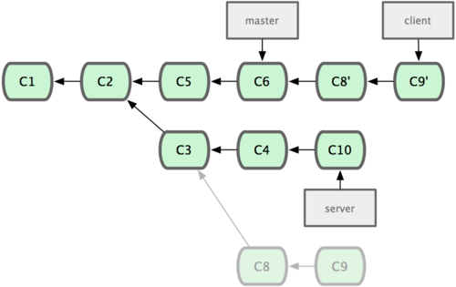
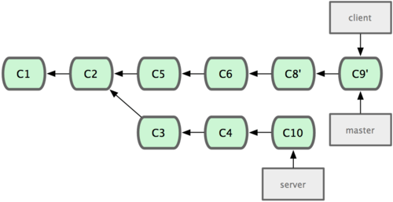
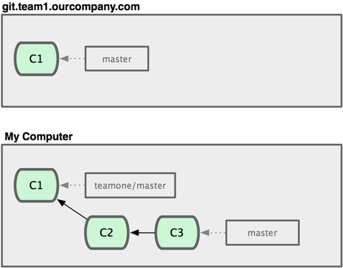
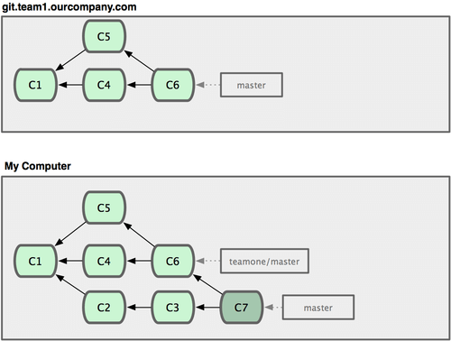
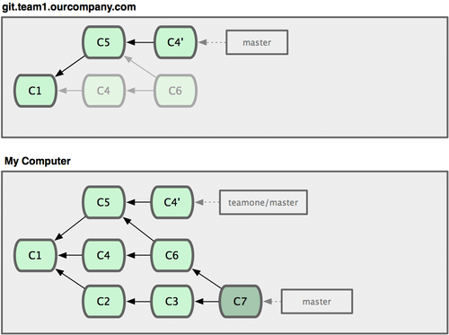
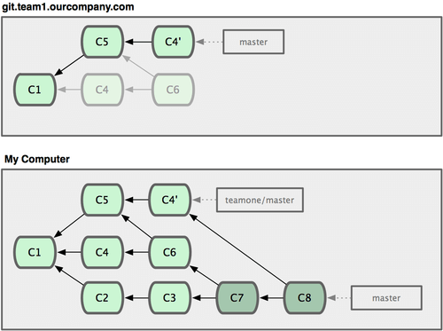

# 分支的衍合

把一个分支中的修改整合到另一个分支的办法有两种：merge 和 rebase（译注：rebase 的翻译暂定为“衍合”，大家知道就可以了。）。在本章我们会学习什么是衍合，如何使用衍合，为什么衍合操作如此富有魅力，以及我们应该在什么情况下使用衍合。

基本的衍合操作
请回顾之前有关合并的一节（见图 1.1），你会看到开发进程分叉到两个不同分支，又各自提交了更新。

图 1.1 最初分叉的提交历史。
之前介绍过，最容易的整合分支的方法是 merge 命令，它会把两个分支最新的快照（C3 和 C4）以及二者最新的共同祖先（C2）进行三方合并，合并的结果是产生一个新的提交对象（C5）。如图 1.2 所示：

图 1.2. 通过合并一个分支来整合分叉了的历史。
其实，还有另外一个选择：你可以把在 C3 里产生的变化补丁在 C4 的基础上重新打一遍。在 Git 里，这种操作叫做衍合（rebase）。有了 rebase 命令，就可以把在一个分支里提交的改变移到另一个分支里重放一遍。

在上面这个例子中，运行：

$ git checkout experiment
$ git rebase master
First, rewinding head to replay your work on top of it...
Applying: added staged command
它的原理是回到两个分支最近的共同祖先，根据当前分支（也就是要进行衍合的分支 experiment）后续的历次提交对象（这里只有一个 C3），生成一系列文件补丁，然后以基底分支（也就是主干分支master）最后一个提交对象（C4）为新的出发点，逐个应用之前准备好的补丁文件，最后会生成一个新的合并提交对象（C3'），从而改写 experiment 的提交历史，使它成为 master 分支的直接下游，如图 1。3 所示：

图 1.3. 把 C3 里产生的改变到 C4 上重演一遍。
现在回到 master 分支，进行一次快进合并（见图 1.4）：

图 1.4. master 分支的快进。
现在的 C3' 对应的快照，其实和普通的三方合并，即上个例子中的 C5 对应的快照内容一模一样了。虽然最后整合得到的结果没有任何区别，但衍合能产生一个更为整洁的提交历史。如果视察一个衍合过的分支的历史记录，看起来会更清楚：仿佛所有修改都是在一根线上先后进行的，尽管实际上它们原本是同时并行发生的。

一般我们使用衍合的目的，是想要得到一个能在远程分支上干净应用的补丁 — 比如某些项目你不是维护者，但想帮点忙的话，最好用衍合：先在自己的一个分支里进行开发，当准备向主项目提交补丁的时候，根据最新的 origin/master 进行一次衍合操作然后再提交，这样维护者就不需要做任何整合工作（译注：实际上是把解决分支补丁同最新主干代码之间冲突的责任，化转为由提交补丁的人来解决。），只需根据你提供的仓库地址作一次快进合并，或者直接采纳你提交的补丁。

请注意，合并结果中最后一次提交所指向的快照，无论是通过衍合，还是三方合并，都会得到相同的快照内容，只不过提交历史不同罢了。衍合是按照每行的修改次序重演一遍修改，而合并是把最终结果合在一起。

有趣的衍合
衍合也可以放到其他分支进行，并不一定非得根据分化之前的分支。以图 3-31 的历史为例，我们为了给服务器端代码添加一些功能而创建了特性分支 server，然后提交 C3 和 C4。然后又从 C3 的地方再增加一个client 分支来对客户端代码进行一些相应修改，所以提交了 C8 和 C9。最后，又回到 server 分支提交了 C10。

图 1.5. 从一个特性分支里再分出一个特性分支的历史。
假设在接下来的一次软件发布中，我们决定先把客户端的修改并到主线中，而暂缓并入服务端软件的修改（因为还需要进一步测试）。这个时候，我们就可以把基于 client 分支而非 server 分支的改变（即 C8 和 C9），跳过 server 直接放到 master 分支中重演一遍，但这需要用 git rebase 的 --onto 选项指定新的基底分支 master：

$ git rebase --onto master server client
这好比在说：“取出 client 分支，找出 client 分支和 server 分支的共同祖先之后的变化，然后把它们在 master 上重演一遍”。是不是有点复杂？不过它的结果如图 1.6 所示，非常酷（译注：虽然client 里的 C8, C9 在 C3 之后，但这仅表明时间上的先后，而非在 C3 修改的基础上进一步改动，因为server 和 client 这两个分支对应的代码应该是两套文件，虽然这么说不是很严格，但应理解为在 C3 时间点之后，对另外的文件所做的 C8，C9 修改，放到主干重演。）：

图 1.6. 将特性分支上的另一个特性分支衍合到其他分支。
现在可以快进 master 分支了（见图 1.7）：

$ git checkout master
$ git merge client

图 1.7. 快进 master 分支，使之包含 client 分支的变化。
现在我们决定把 server 分支的变化也包含进来。我们可以直接把 server 分支衍合到 master，而不用手工切换到 server 分支后再执行衍合操作 — git rebase [主分支] [特性分支] 命令会先取出特性分支 server，然后在主分支 master 上重演：

$ git rebase master server
于是，server 的进度应用到 master 的基础上，如图 1.8 所示：

图 1.8. 在 master 分支上衍合 server 分支。
然后就可以快进主干分支 master 了：

$ git checkout master
$ git merge server
现在 client 和 server 分支的变化都已经集成到主干分支来了，可以删掉它们了。最终我们的提交历史会变成图 1.8 的样子：

$ git branch -d client
$ git branch -d server

图 1.9 最终的提交历史
衍合的风险
呃，奇妙的衍合也并非完美无缺，要用它得遵守一条准则：

一旦分支中的提交对象发布到公共仓库，就千万不要对该分支进行衍合操作。

如果你遵循这条金科玉律，就不会出差错。否则，人民群众会仇恨你，你的朋友和家人也会嘲笑你，唾弃你。

在进行衍合的时候，实际上抛弃了一些现存的提交对象而创造了一些类似但不同的新的提交对象。如果你把原来分支中的提交对象发布出去，并且其他人更新下载后在其基础上开展工作，而稍后你又用 git rebase 抛弃这些提交对象，把新的重演后的提交对象发布出去的话，你的合作者就不得不重新合并他们的工作，这样当你再次从他们那里获取内容时，提交历史就会变得一团糟。

下面我们用一个实际例子来说明为什么公开的衍合会带来问题。假设你从一个中央服务器克隆然后在它的基础上搞了一些开发，提交历史类似图 1.9 所示：

图 1.10 克隆一个仓库，在其基础上工作一番。
现在，某人在 C1 的基础上做了些改变，并合并他自己的分支得到结果 C6，推送到中央服务器。当你抓取并合并这些数据到你本地的开发分支中后，会得到合并结果 C7，历史提交会变成图 1.11 这样：

图 1.11 抓取他人提交，并入自己主干。
接下来，那个推送 C6 上来的人决定用衍合取代之前的合并操作；继而又用 git push --force 覆盖了服务器上的历史，得到 C4'。而之后当你再从服务器上下载最新提交后，会得到：

图 1.12 有人推送了衍合后得到的 C4'，丢弃了你作为开发基础的 C4 和 C6。
下载更新后需要合并，但此时衍合产生的提交对象 C4' 的 SHA-1 校验值和之前 C4 完全不同，所以 Git 会把它们当作新的提交对象处理，而实际上此刻你的提交历史 C7 中早已经包含了 C4 的修改内容，于是合并操作会把 C7 和 C4' 合并为 C8（见图 1.13）:

图 1.13 你把相同的内容又合并了一遍，生成一个新的提交 C8。
C8 这一步的合并是迟早会发生的，因为只有这样你才能和其他协作者提交的内容保持同步。而在 C8 之后，你的提交历史里就会同时包含 C4 和 C4'，两者有着不同的 SHA-1 校验值，如果用 git log 查看历史，会看到两个提交拥有相同的作者日期与说明，令人费解。而更糟的是，当你把这样的历史推送到服务器后，会再次把这些衍合后的提交引入到中央服务器，进一步困扰其他人（译注：这个例子中，出问题的责任方是那个发布了 C6 后又用衍合发布 C4' 的人，其他人会因此反馈双重历史到共享主干，从而混淆大家的视听。）。

如果把衍合当成一种在推送之前清理提交历史的手段，而且仅仅衍合那些尚未公开的提交对象，就没问题。如果衍合那些已经公开的提交对象，并且已经有人基于这些提交对象开展了后续开发工作的话，就会出现叫人沮丧的麻烦。
